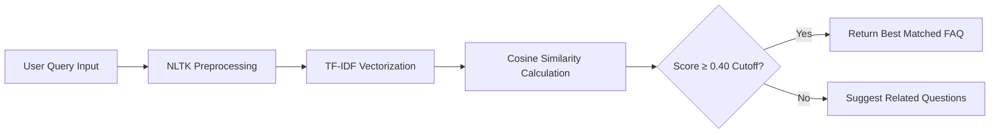

# 🏦 NovaBank | Intelligent Banking FAQ Chatbot & Knowledge Base

[](https://codealpha-faq-chatbot-xf7i.onrender.com)


> 🚀 **Live Web Application**: **[https://codealpha-faq-chatbot-xf7i.onrender.com](https://codealpha-faq-chatbot-xf7i.onrender.com)**

An intelligent, full-stack Banking FAQ Assistant and Knowledge Base built with **Python Flask**, **Scikit-Learn (TF-IDF & Cosine Similarity)**, and a **Glassmorphic UI**.

---

## ✨ Features


- 💬 **Interactive AI Chat Console**: Instant query answering using TF-IDF term frequency vectors and Cosine Similarity cutoff thresholding.
- 📚 **173+ Indexed Banking FAQs**: Pre-indexed questions covering 17 banking categories (UPI, Credit Cards, Loans, Security & Fraud, ATM Services, etc.).
- 📊 **Engine Specs & Metrics Dashboard**: Real-time visualization of vocabulary size, dataset counts, and multi-stage NLP pipeline execution.
- 🎨 **Glassmorphism Design System**: Modern dark & light mode UI with responsive layouts and custom CSS animations.
- 🧪 **Comprehensive Test Suite**: Automated unit and endpoint integration tests included.

---

## 🛠️ Query Processing NLP Pipeline



---

## 🚀 Quick Start Guide

### 1. Clone the Repository
```bash
git clone https://github.com/Lokesh-ig/CodeAlpha_FAQ_Chatbot.git
cd CodeAlpha_FAQ_Chatbot
```

### 2. Set Up Virtual Environment & Dependencies
```bash
python -m venv venv
# On Windows:
.\venv\Scripts\activate
# On macOS/Linux:
source venv/bin/activate

pip install -r requirements.txt
```

### 3. Run the Flask Web Application
```bash
python app.py
```
Open your browser and navigate to **`http://localhost:5000`**

---

## 📂 Project Structure

```
CodeAlpha_FAQ_Chatbot/
├── app.py                   # Flask Web Server & API Endpoints
├── faq_engine.py            # TF-IDF & Cosine Similarity Engine
├── preprocessing.py         # NLTK Text Cleaning & Tokenization
├── data/
│   └── faqs.json            # 173 Structured Banking FAQs
├── static/
│   ├── css/style.css        # Modern Glassmorphism Styling
│   ├── js/app.js            # Frontend Interactive Application Logic
│   └── favicon.svg          # Brand Logo Favicon
├── templates/
│   └── index.html           # Single Page App Template
├── requirements.txt         # Project Dependencies
└── README.md                # Documentation
```

---

## 📜 License

Distributed under the MIT License. See `LICENSE` for more information.
